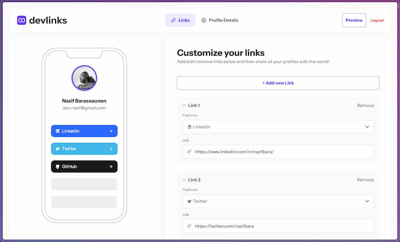

# Frontend Mentor - Link-sharing app solution

This is a solution to the [Link-sharing app challenge on Frontend Mentor](https://www.frontendmentor.io/challenges/linksharing-app-Fbt7yweGsT). Frontend Mentor challenges help you improve your coding skills by building realistic projects.

## Table of contents

- [Overview](#overview)
  - [The challenge](#the-challenge)
  - [Links](#links)
- [Built with](#built-with)
- [Author](#author)

## Overview

### The challenge

Users should be able to:

- Create, read, update, delete links and see previews in the mobile mockup
- Receive validations if the links form is submitted without a URL or with the wrong URL pattern for the platform
- Drag and drop links to reorder them
- Add profile details like profile picture, first name, last name, and email
- Receive validations if the profile details form is saved with no first or last name
- Preview their devlinks profile and copy the link to their clipboard
- View the optimal layout for the interface depending on their device's screen size
- See hover and focus states for all interactive elements on the page
- Save details to a database
- Create an account and log in

### Links

- [Solution](https://www.frontendmentor.io/solutions/linksharing-app-using-sveltekit-ELY3M9fSt0)
- [Live Site](https://link-sharing-svelte.netlify.app/)

## Built with

- Semantic HTML5 markup
- CSS custom properties
- Flexbox
- CSS Grid
- Mobile-first workflow
- [Sveltekit](https://kit.svelte.dev/) - JS library
- [Superforms](https://superforms.rocks/) - SvelteKit library for server and client validation of forms
- [Melt UI](https://melt-ui.com/) - Headless UI library for Svelte
- [Firebase](https://firebase.google.com/) - Backend
- [sortablejs](https://sortablejs.github.io/Sortable/) - JavaScript library for reorderable drag-and-drop lists

## Author

- Website - [nazifbara.com](https://www.nazifbara.com)
- Twitter - [@nazifbara](https://www.twitter.com/nazifbara)
- Frontend Mentor - [@nazifbara](https://www.frontendmentor.io/profile/nazifbara)
